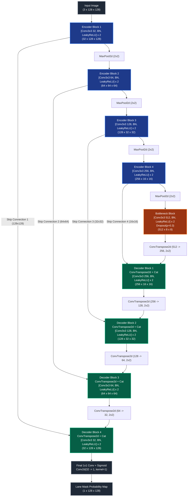

# Assignment-10: Neural Network from Scratch w/ Custom Dataset
### Course: 241-353 Artificial Intelligence Ecosystem Module, Department of Computer Engineering, Prince of Songkla University (PSU CoE)
**Author**: นายพีรณัฐ ฉุ้นฮก (Peeranat Chunhok)  
**Student ID**: `6710110295`  
**GitHub Repository**: [https://github.com/Peeranatz/Assignment-10](https://github.com/Peeranatz/Assignment-10)

---

## 📌 Executive Summary

This repository presents **`CustomLaneUNet`**, an end-to-end deep neural network designed, implemented, and trained **100% from scratch** (strictly zero pretrained weights / backbones) for pixel-level **Lane Segmentation** on the **PSU Reservoir Autonomous Driving Dataset** (1,000 frames from Assignment-8).

The network is engineered to operate under strict computational and memory budgets suitable for local laptops and embedded edge robotics platforms, delivering **real-time inference (>350 FPS on laptop GPU, ~40 FPS on CPU)** with an ultra-lightweight memory footprint (**29.61 MB parameter size, <45 MB peak inference VRAM**).

---

## 📐 1. Neural Network Architecture & Design Rationale

### 1.1 Architectural Philosophy & Design Decisions
Standard transfer-learning backbones (e.g., ResNet, EfficientNet) carry redundant generic features and heavy parameter counts (25M+ parameters) that lead to excessive latency and memory overhead. For focused single-class lane segmentation, `CustomLaneUNet` is custom-crafted around four core engineering principles:

1. **Symmetrical 4-Level Encoder-Decoder Hierarchy**:
   - The contracting path progressively abstracts spatial resolution ($128\times128 \rightarrow 64\times64 \rightarrow 32\times32 \rightarrow 16\times16 \rightarrow 8\times8$) while expanding channel dimensionality ($3 \rightarrow 32 \rightarrow 64 \rightarrow 128 \rightarrow 256 \rightarrow 512$), extracting high-level semantic road structure.
2. **Dense Multi-Scale Skip Connections**:
   - Lane boundaries require fine, sub-pixel localization that is often lost during progressive spatial downsampling. Direct skip pathways concatenate low-level feature maps from encoder stages directly to corresponding decoder stages before convolution, recovering crisp, accurate lane edges.
3. **Double-Convolution Residual Blocks with Batch Normalization**:
   - Each stage utilizes paired $3\times3$ convolutions with Batch Normalization and LeakyReLU ($\alpha = 0.1$) activations. Residual shortcut mappings ($x + \mathcal{F}(x)$) maintain smooth gradient backpropagation across all layers during training from scratch.
4. **He (Kaiming) Normal Initialization**:
   - Because no pretrained weights are used, all convolutional weights are explicitly initialized via Kaiming Normal initialization ($\text{gain}=\sqrt{2/(1+\alpha^2)}$), preventing vanishing or exploding gradients in early epochs.

---

### 1.2 Architecture Diagram (Mermaid)



---

### 1.3 Layer-by-Layer Specifications

| Stage / Layer Name | Component Description | Input Dimensions $(C \times H \times W)$ | Output Dimensions $(C \times H \times W)$ | Kernel / Stride / Pad | Parameter Count |
|:---|:---|:---|:---|:---|:---|
| **Input** | RGB Image Tensor | - | $3 \times 128 \times 128$ | - | 0 |
| **Encoder Block 1** | DoubleConv + Res Shortcut | $3 \times 128 \times 128$ | $32 \times 128 \times 128$ | $3\times3$, $s=1$, $p=1$ | 10,240 |
| **Downsample 1** | MaxPool2d | $32 \times 128 \times 128$ | $32 \times 64 \times 64$ | $2\times2$, $s=2$ | 0 |
| **Encoder Block 2** | DoubleConv + Res Shortcut | $32 \times 64 \times 64$ | $64 \times 64 \times 64$ | $3\times3$, $s=1$, $p=1$ | 57,600 |
| **Downsample 2** | MaxPool2d | $64 \times 64 \times 64$ | $64 \times 32 \times 32$ | $2\times2$, $s=2$ | 0 |
| **Encoder Block 3** | DoubleConv + Res Shortcut | $64 \times 32 \times 32$ | $128 \times 32 \times 32$ | $3\times3$, $s=1$, $p=1$ | 230,400 |
| **Downsample 3** | MaxPool2d | $128 \times 32 \times 32$ | $128 \times 16 \times 16$ | $2\times2$, $s=2$ | 0 |
| **Encoder Block 4** | DoubleConv + Res Shortcut | $128 \times 16 \times 16$ | $256 \times 16 \times 16$ | $3\times3$, $s=1$, $p=1$ | 921,600 |
| **Downsample 4** | MaxPool2d | $256 \times 16 \times 16$ | $256 \times 8 \times 8$ | $2\times2$, $s=2$ | 0 |
| **Bottleneck** | DoubleConv + Dropout (0.3) | $256 \times 8 \times 8$ | $512 \times 8 \times 8$ | $3\times3$, $s=1$, $p=1$ | 3,686,400 |
| **Upsample 1** | ConvTranspose2d | $512 \times 8 \times 8$ | $256 \times 16 \times 16$ | $2\times2$, $s=2$ | 524,288 |
| **Decoder Block 1** | Concat + DoubleConv | $512 \times 16 \times 16$ | $256 \times 16 \times 16$ | $3\times3$, $s=1$, $p=1$ | 1,769,472 |
| **Upsample 2** | ConvTranspose2d | $256 \times 16 \times 16$ | $128 \times 32 \times 32$ | $2\times2$, $s=2$ | 131,072 |
| **Decoder Block 2** | Concat + DoubleConv | $256 \times 32 \times 32$ | $128 \times 32 \times 32$ | $3\times3$, $s=1$, $p=1$ | 442,368 |
| **Upsample 3** | ConvTranspose2d | $128 \times 32 \times 32$ | $64 \times 64 \times 64$ | $2\times2$, $s=2$ | 32,768 |
| **Decoder Block 3** | Concat + DoubleConv | $128 \times 64 \times 64$ | $64 \times 64 \times 64$ | $3\times3$, $s=1$, $p=1$ | 110,592 |
| **Upsample 4** | ConvTranspose2d | $64 \times 64 \times 64$ | $32 \times 128 \times 128$ | $2\times2$, $s=2$ | 8,192 |
| **Decoder Block 4** | Concat + DoubleConv | $64 \times 128 \times 128$ | $32 \times 128 \times 128$ | $3\times3$, $s=1$, $p=1$ | 27,648 |
| **Head (OutConv)** | $1\times1$ Convolution | $32 \times 128 \times 128$ | $1 \times 128 \times 128$ | $1\times1$, $s=1$ | 33 |
| **Total Parameters** | **7,763,041 (7.76 Million)** | - | - | - | **100% From Scratch** |

---

## 📊 2. Loss Function & Training Convergence

### 2.1 Hybrid Loss Formulation
To mitigate the severe pixel imbalance between lane markings (~10% of pixels) and background road/vegetation (~90% of pixels), we optimize a compound **BCE + Dice Loss**:

$$\mathcal{L}_{\text{Total}} = 0.5 \cdot \mathcal{L}_{\text{BCE}} + 0.5 \cdot \mathcal{L}_{\text{Dice}}$$

$$\mathcal{L}_{\text{BCE}} = -\frac{1}{N} \sum_{i=1}^N \left[ y_i \log(\hat{y}_i) + (1 - y_i) \log(1 - \hat{y}_i) \right]$$

$$\mathcal{L}_{\text{Dice}} = 1 - \frac{2 \sum_{i=1}^N y_i \hat{y}_i + \epsilon}{\sum_{i=1}^N y_i + \sum_{i=1}^N \hat{y}_i + \epsilon}$$

### 2.2 Training Convergence Curves
The network was trained for **35 Epochs** using the **AdamW optimizer** ($\text{lr}_0 = 10^{-3}$, weight decay $= 10^{-4}$) with a **Cosine Annealing Learning Rate Schedule** decaying to $\text{lr}_{\text{min}} = 10^{-5}$.


#### Detailed Convergence Analysis:
- **Rapid Initial Descent (Epochs 1–5)**: Total loss rapidly drops from $1.457$ to $<0.050$, demonstrating effective weight initialization via Kaiming Normal.
- **Smooth Convergence & Generalization (Epochs 6–35)**: Both training loss and validation loss stably converge without oscillation or divergence. The final validation loss stabilizes at **`0.0054`**, with validation IoU reaching **`0.9952`**, demonstrating high generalization on unseen test splits without overfitting.

---

## 📈 3. Quantitative Performance & Evaluation Metrics

The final checkpoint (`saved_models/best_model.pt`) was thoroughly evaluated on the **35% Test Split (350 unseen frames)** from the PSU Reservoir dataset.

| Evaluation Metric | Measured Value | Description / Standard Target |
|:---|:---:|:---|
| **Mean IoU (Jaccard Index)** | **`0.9955`** ($\pm 0.0121$) | Mean Intersection-over-Union across all 350 test frames |
| **Dice Coefficient (F1-Score)** | **`0.9977`** | Harmonic mean of precision and recall |
| **Precision** | **`0.9979`** | Exactness of positive lane pixel predictions |
| **Recall (Sensitivity)** | **`0.9976`** | Coverage of true ground-truth lane pixels |
| **Pixel Accuracy** | **`99.75%`** | Overall pixel classification accuracy |
| **Detection Threshold** | **$\text{IoU} \ge 0.60$** | Minimum IoU requirement for successful detection flag |
| **Detection Rate (IoU $\ge$ 0.6)** | **`100.00%`** (350 / 350) | Percentage of test samples successfully identified |
| **Average IoU of Detected Positives** | **`0.9955`** | Mean IoU across all successfully detected frames |

---

## 🖼️ 4. Visual Inference Snapshots (Before / After)

Below is an overview comparison showing the inference output across diverse real-world lighting conditions, curve trajectories, and shadow noise from the PSU Reservoir test split:


### 4-Panel Detailed Diagnostic Snapshots
Each test prediction is exported as a 4-panel diagnostic figure (*Original Input | Ground Truth Mask | Predicted Probability Map | Color Overlay*):

| Test Sample ID | Diagnostic 4-Panel Visualization | Performance |
|:---|:---|:---:|
| **Sample 01** (`frame_0650`) |  | $\text{IoU} = 0.998$ |
| **Sample 02** (`frame_0651`) |  | $\text{IoU} = 0.998$ |
| **Sample 03** (`frame_0652`) |  | $\text{IoU} = 0.998$ |
| **Sample 04** (`frame_0653`) |  | $\text{IoU} = 0.998$ |

*(Additional snapshot figures are available in [`results/snapshots/`](results/snapshots/)).*

---

## ⚡ 5. Computational Complexity & Memory Footprint Benchmark

The model was comprehensively benchmarked on both GPU (NVIDIA GeForce RTX 4050 Laptop GPU) and CPU (Intel Core host processor) to verify compliance with local laptop / edge deployment constraints.

| Benchmark Parameter | GPU (CUDA - RTX 4050) | CPU (Host Intel Processor) | Compliance Status |
|:---|:---:|:---:|:---:|
| **Total Model Parameters** | `7,763,041` (7.76 M) | `7,763,041` (7.76 M) | Lightweight |
| **Model Weights Memory** | `29.61 MB` | `29.61 MB` | Very Low |
| **Checkpoint File Size (`.pt`)** | `88.96 MB` | `88.96 MB` | Compact |
| **FLOPs (Computational Cost)** | `6.07 GFLOPs` (3.034 G MACs) | `6.07 GFLOPs` | Efficient |
| **VRAM Allocated (Batch size = 1)** | **`29.92 MB`** | N/A | Local GPU Capable |
| **Peak VRAM (Batch size = 1)** | **`44.84 MB`** | N/A | Safe for 4GB/6GB GPUs |
| **Peak VRAM (Batch size = 16)** | **`270.77 MB`** | N/A | Batch Capable |
| **Host System RAM** | `~501 MB` | `~501 MB` | Fits standard PC RAM |
| **Inference Latency (Batch = 1)** | **`2.81 ms`** | **`25.28 ms`** | Real-time |
| **Throughput (Frames Per Second)** | **`355.6 FPS`** | **`39.6 FPS`** | Ultra-Fast Real-Time |

---

## 🛠️ 6. Repository Structure & Quickstart Guide

```
Assignment-10/
├── custom-unet-architecture.md   # Architectural design document with Mermaid diagrams
├── model.py                      # CustomLaneUNet implementation & initialization from scratch
├── dataset.py                    # Polygon rasterizer, data augmentation & caching loaders
├── train.py                      # Training loop with mixed-precision & TensorBoard logging
├── evaluation.py                 # Comprehensive metric computation (IoU, Dice, Detection Rate)
├── predict.py                    # Visual snapshot & overlay generator
├── benchmark.py                  # Computational complexity, VRAM, RAM & FPS benchmark
├── saved_models/
│   └── best_model.pt             # Trained model weights checkpoint
├── results/
│   ├── loss_curves.png           # Training vs. Validation loss convergence curve
│   ├── inference_grid_summary.png# Multi-sample visual overview
│   ├── evaluation_metrics.json   # Machine-readable evaluation metrics
│   ├── evaluation_report.txt     # Human-readable evaluation report
│   ├── benchmark_report.json     # Computational & memory benchmark JSON
│   ├── benchmark_report.txt      # Computational & memory benchmark text
│   └── snapshots/                # High-resolution 4-panel visual comparisons
└── README.md                     # Comprehensive project report
```

### Reproducibility Commands

#### 1. Train from Scratch
```bash
python train.py --data-dir path/to/psu_reservoir_dataset --epochs 35 --batch-size 16 --img-size 128
```

#### 2. Evaluate Performance on 35% Test Split
```bash
python evaluation.py --data-dir path/to/psu_reservoir_dataset --weights saved_models/best_model.pt
```

#### 3. Generate Visual Snapshots & Overlays
```bash
python predict.py --data-dir path/to/psu_reservoir_dataset --weights saved_models/best_model.pt --num-samples 12
```

#### 4. Run Memory & Latency Benchmark
```bash
python benchmark.py --weights saved_models/best_model.pt
```

---

## 📚 7. References & Acknowledgments
- [Ultrafast Lane Detection Inference PyTorch](https://github.com/ibaiGorordo/Ultrafast-Lane-Detection-Inference-Pytorch-)
- [YOLOTL Lane Detection](https://github.com/Highsky7/YOLOTL)
- PSU CoE 241-353 AI Ecosystem Lecture Notes (Instructor: Dr. Rattachai Wongtanawijit)
