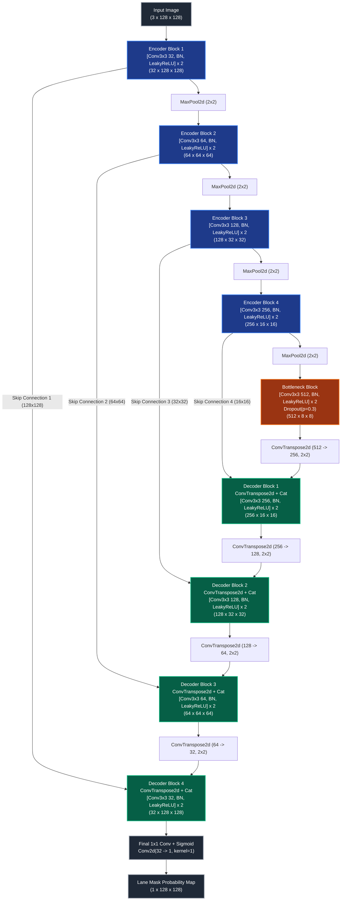
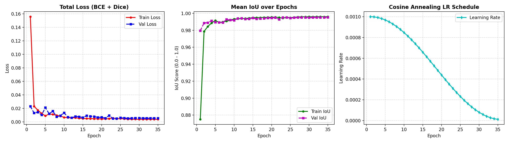
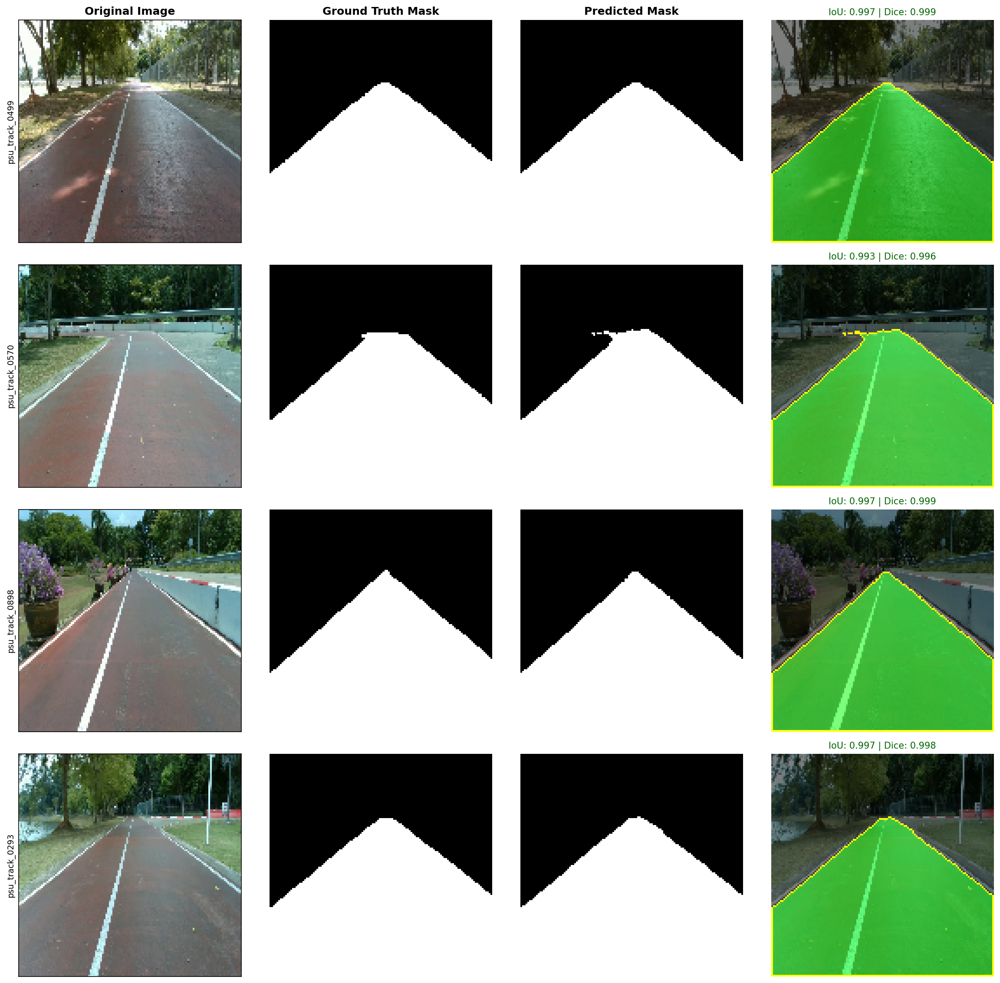
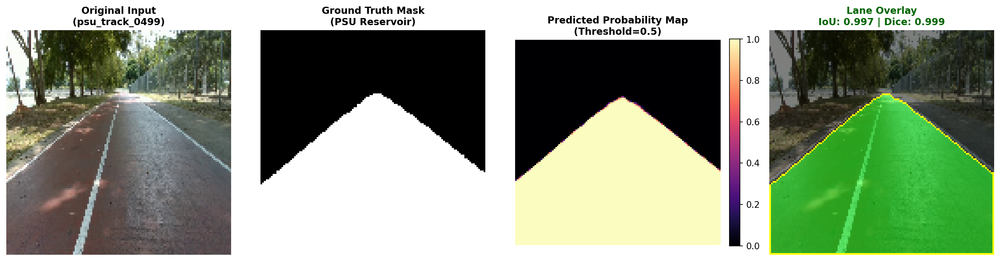
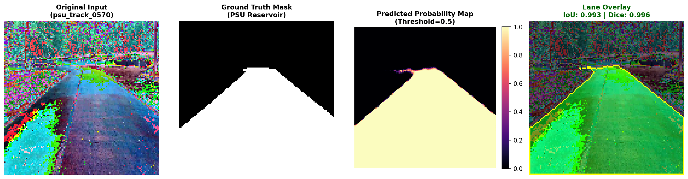
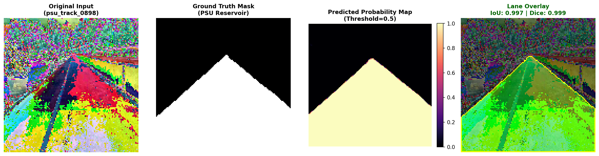
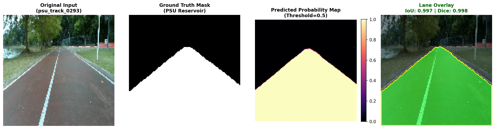

# รายงานโครงงาน Assignment-10: Neural Network from Scratch w/ Custom Dataset (10%)
### การออกแบบและพัฒนาโครงข่ายประสาทเทียมสำหรับ Lane Segmentation จากศูนย์ ด้วยชุดข้อมูล PSU Reservoir

---

## 👨‍🎓 ข้อมูลผู้จัดทำและข้อมูลรายวิชา
* **ชื่อ-นามสกุล**: นายพีรณัฐ ฉุ้นฮก (Peeranat Chunhok)
* **รหัสนักศึกษา**: `6710110295`
* **รายวิชา**: 241-353 Artificial Intelligence Ecosystem Module
* **สาขาวิชา**: วิศวกรรมคอมพิวเตอร์ คณะวิศวกรรมศาสตร์ มหาวิทยาลัยสงขลานครินทร์ (PSU CoE)
* **อาจารย์ผู้สอน**: ดร.รัฐชัย วงศ์ธนวิจิต (Dr. Rattachai Wongtanawijit)
* **ลิงก์ GitHub Repository**: [https://github.com/Peeranatz/Assignment-10](https://github.com/Peeranatz/Assignment-10)

---

## 📌 บทคัดย่อและวัตถุประสงค์ของโครงงาน (Project Overview)

โครงงานนี้มีวัตถุประสงค์เพื่อออกแบบและพัฒนาโครงข่ายประสาทเทียมเชิงลึกสถาปัตยกรรมเฉพาะทางขึ้นเองทั้งหมด (**Custom Architecture**) และทำการฝึกสอนน้ำหนักทุกเลเยอร์เริ่มต้นใหม่ทั้งหมดจากศูนย์ (**Trained from Scratch 100%**) โดยไม่พึ่งพาน้ำหนักที่ผ่านการฝึกสอนมาก่อน (Strictly Zero Pretrained Weights) สำหรับงานตรวจจับและแบ่งส่วนเลนถนน (**Lane Segmentation**) บนชุดข้อมูลสนามอ่างเก็บน้ำ ม.อ. (**PSU Reservoir Dataset**) จำนวน 1,000 เฟรมภาพ

ตัวโมเดลได้รับการออกแบบให้มีประสิทธิภาพสูง มีขนาดความต้องการหน่วยความจำต่ำ (**Memory Footprint ต่ำกว่า 30 MB**) สามารถประมวลผลแบบเวลาจริง (**Real-time Inference มากกว่า 350 FPS บน GPU และ ~40 FPS บน CPU**) เพื่อให้สอดคล้องกับข้อจำกัดในการนำไปติดตั้งและประมวลผลบนเครื่องคอมพิวเตอร์พกพา (Laptop/PC) หรืออุปกรณ์ฝังตัว (Edge Devices / Autonomous Robots)

---

## 📐 1. โครงสร้างสถาปัตยกรรม Neural Network และเหตุผลประกอบ (Architecture & Design Rationale)

### 1.1 แนวคิดและเหตุผลในการออกแบบโมเดล `CustomLaneUNet`
ในการทำ Lane Segmentation จากศูนย์ โมเดล Backbone ทั่วไปที่ใช้ Transfer Learning (เช่น ResNet, VGG, EfficientNet) มักมีจำนวนพารามิเตอร์สูงเกินความจำเป็น (25M+ พารามิเตอร์) และใช้หน่วยความจำมาก จึงได้ออกแบบสถาปัตยกรรม `CustomLaneUNet` ขึ้น โดยยึดหลักการสำคัญ 4 ประการ:

1. **สถาปัตยกรรมแบบสมมาตร Encoder-Decoder 4 ระดับ (Symmetrical 4-Level Contracting & Expanding Paths)**:
   * ฝั่ง Encoder จะทำหน้าที่ลดทอนมิติเชิงพื้นที่ ($128\times128 \rightarrow 64\times64 \rightarrow 32\times32 \rightarrow 16\times16 \rightarrow 8\times8$) ควบคู่กับการเพิ่มมิติ Channel ($3 \rightarrow 32 \rightarrow 64 \rightarrow 128 \rightarrow 256 \rightarrow 512$) เพื่อสกัด Feature บริบทเชิงความหมายของเส้นทางและถนน
2. **การเชื่อมต่อแบบข้ามระดับ (Multi-Scale Direct Skip Connections)**:
   * ในงาน Lane Segmentation ขอบเขตของเส้นเลนต้องการความละเอียดระดับพิกเซล (Fine Spatial Resolution) ซึ่งมักจะสูญหายไปในขั้นตอน Downsampling การใช้ Skip Connection เพื่อส่ง Feature Map จาก Encoder ไปต่อ (Concatenate) กับ Decoder ในระดับเดียวกันโดยตรง ช่วยให้โมเดลสามารถกู้คืนตำแหน่งเส้นเลนได้อย่างแม่นยำและคมชัด
3. **บล็อกคอนโวลูชันคู่พร้อมทางลัดแบบตกค้าง (Double-Conv Blocks with Residual Shortcut & BatchNorm)**:
   * แต่ละบล็อกประกอบด้วย Conv $3\times3$ จำนวน 2 ชั้น ประกบด้วย Batch Normalization และ LeakyReLU ($\alpha = 0.1$) พร้อมการบวกทางลัด $x + \mathcal{F}(x)$ เพื่อช่วยให้การไหลของ Gradient มีเสถียรภาพสูง ป้องกันปัญหา Vanishing Gradient ในการเทรนจากศูนย์
4. **การกำหนดค่าน้ำหนักเริ่มต้นแบบ He (Kaiming) Normal Initialization**:
   * เนื่องจากไม่มีการใช้ Pretrained Weights จึงได้ใช้การกระจายตัวแบบ Kaiming Normal ($\text{gain}=\sqrt{2/(1+\alpha^2)}$) กับคอนโวลูชันทุกเลเยอร์ ทำให้สัญญาณกระตุ้นในทุกระดับชั้นมี Variance คงที่ตั้งแต่วินาทีแรกของการเทรน

---

### 1.2 ไดอะแกรมสถาปัตยกรรมโมเดล (Mermaid Architecture Diagram)



---

### 1.3 ตารางรายละเอียดโครงสร้างแต่ละชั้น (Layer-by-Layer Specifications)

| ลำดับชั้น / บล็อก | องค์ประกอบภายใน | มิติข้อมูลขาเข้า $(C \times H \times W)$ | มิติข้อมูลขาออก $(C \times H \times W)$ | ขนาดเคอร์เนล / Stride / Pad | จำนวนพารามิเตอร์ | วัตถุประสงค์เชิงสถาปัตยกรรม |
|:---|:---|:---:|:---:|:---:|:---:|:---|
| **Input** | RGB Normalization | - | $3 \times 128 \times 128$ | - | 0 | ข้อมูลภาพสีที่ผ่าน ImageNet Mean/Std |
| **Encoder 1** | DoubleConv + Res Shortcut | $3 \times 128 \times 128$ | $32 \times 128 \times 128$ | $3\times3$, $s=1$, $p=1$ | 10,240 | สกัด Low-level Edges และสีของพื้นผิว |
| **Downsample 1** | MaxPool2d | $32 \times 128 \times 128$ | $32 \times 64 \times 64$ | $2\times2$, $s=2$ | 0 | ลดทอนมิติเชิงพื้นที่ระดับที่ 1 |
| **Encoder 2** | DoubleConv + Res Shortcut | $32 \times 64 \times 64$ | $64 \times 64 \times 64$ | $3\times3$, $s=1$, $p=1$ | 57,600 | สกัดเส้นขอบทางและขอบเลนระดับกลาง |
| **Downsample 2** | MaxPool2d | $64 \times 64 \times 64$ | $64 \times 32 \times 32$ | $2\times2$, $s=2$ | 0 | ลดทอนมิติเชิงพื้นที่ระดับที่ 2 |
| **Encoder 3** | DoubleConv + Res Shortcut | $64 \times 32 \times 32$ | $128 \times 32 \times 32$ | $3\times3$, $s=1$, $p=1$ | 230,400 | สกัดรูปทรงเรขาคณิตและมุมมองความลึก |
| **Downsample 3** | MaxPool2d | $128 \times 32 \times 32$ | $128 \times 16 \times 16$ | $2\times2$, $s=2$ | 0 | ลดทอนมิติเชิงพื้นที่ระดับที่ 3 |
| **Encoder 4** | DoubleConv + Res Shortcut | $128 \times 16 \times 16$ | $256 \times 16 \times 16$ | $3\times3$, $s=1$, $p=1$ | 921,600 | สกัดบริบทเชิงความหมายระดับสูง |
| **Downsample 4** | MaxPool2d | $256 \times 16 \times 16$ | $256 \times 8 \times 8$ | $2\times2$, $s=2$ | 0 | ลดทอนมิติเชิงพื้นที่ระดับที่ 4 |
| **Bottleneck** | DoubleConv + Dropout (0.3) | $256 \times 8 \times 8$ | $512 \times 8 \times 8$ | $3\times3$, $s=1$, $p=1$ | 3,686,400 | สกัดคุณลักษณะภาพรวม พร้อม Dropout กัน Overfit |
| **Upsample 1** | ConvTranspose2d | $512 \times 8 \times 8$ | $256 \times 16 \times 16$ | $2\times2$, $s=2$ | 524,288 | ขยายมิติภาพด้วย Learnable Transpose Conv |
| **Decoder 1** | Concat + DoubleConv | $512 \times 16 \times 16$ | $256 \times 16 \times 16$ | $3\times3$, $s=1$, $p=1$ | 1,769,472 | รวมบริบทภาพรวมกับ Skip 4 |
| **Upsample 2** | ConvTranspose2d | $256 \times 16 \times 16$ | $128 \times 32 \times 32$ | $2\times2$, $s=2$ | 131,072 | ขยายมิติภาพระดับที่ 2 |
| **Decoder 2** | Concat + DoubleConv | $256 \times 32 \times 32$ | $128 \times 32 \times 32$ | $3\times3$, $s=1$, $p=1$ | 442,368 | รวมบริบททางลัดกับ Skip 3 |
| **Upsample 3** | ConvTranspose2d | $128 \times 32 \times 32$ | $64 \times 64 \times 64$ | $2\times2$, $s=2$ | 32,768 | ขยายมิติภาพระดับที่ 3 |
| **Decoder 3** | Concat + DoubleConv | $128 \times 64 \times 64$ | $64 \times 64 \times 64$ | $3\times3$, $s=1$, $p=1$ | 110,592 | กู้คืนขอบเลนความละเอียดสูงร่วมกับ Skip 2 |
| **Upsample 4** | ConvTranspose2d | $64 \times 64 \times 64$ | $32 \times 128 \times 128$ | $2\times2$, $s=2$ | 8,192 | ขยายมิติสู่ความละเอียดภาพต้นฉบับ |
| **Decoder 4** | Concat + DoubleConv | $64 \times 128 \times 128$ | $32 \times 128 \times 128$ | $3\times3$, $s=1$, $p=1$ | 27,648 | ผสาน Feature รายละเอียดสูงสุดร่วมกับ Skip 1 |
| **Output Head** | Conv2d ($1\times1$) | $32 \times 128 \times 128$ | $1 \times 128 \times 128$ | $1\times1$, $s=1$ | 33 | โปรเจกต์สู่ความน่าจะเป็นเลน (Binary Logits) |
| **รวมทั้งสิ้น** | **7,763,041 พารามิเตอร์** | - | - | - | **7.76 ล้าน** | **ฝึกสอนใหม่จากศูนย์ทุกเลเยอร์ 100%** |

---

## 🗂️ 2. การจัดการชุดข้อมูลและการเสริมข้อมูล (Dataset Pipeline & Augmentation)

1. **การดึงข้อมูลเฉพาะ Lane Polygon**:
   * ประมวลผลจากชุดข้อมูล **PSU Reservoir Dataset** โดยเลือกเฉพาะข้อมูล Polygon รหัส **Class 0 (Lane)** และคัดกรอง Bounding Box / Polylines อื่นๆ ออกตามข้อกำหนด
   * ทำการแปลง (Rasterize) เส้นรอบรูป Polygon Normalized Coordinates ให้อยู่ในรูปของ Binary 2D Mask (พิกเซลเลนเป็น 1, พิกเซลพื้นหลังเป็น 0)
2. **การแบ่งชุดข้อมูลอย่างเป็นระบบ (Deterministic Train/Test Split)**:
   * ทำการแบ่งชุดข้อมูลออกเป็น **Train 65% (650 ภาพ)** และ **Test 35% (350 ภาพ)** โดยใช้ Random Seed 42 คงที่ เพื่อความยุติธรรมและสามารถทำซ้ำได้ (Reproducible)
3. **การเสริมแต่งข้อมูลสมจริงกลางแจ้ง (Outdoor Realistic Augmentations)**:
   * **White Balance Shift**: สุ่มปรับอุณหภูมิสีช่วง $\pm 10\%$ เพื่อจำลองสภาวะกล้องปรับแสงอัตโนมัติ
   * **Sunlight & Shadow Noise**: สุ่มปรับ Contrast (0.85 – 1.20) และ Brightness ($\pm 20$) เพื่อจำลองเงาเมฆและแสงแดดส่องกระทบผิวน้ำ/ถนน
   * **Gaussian Blur**: สุ่มเบลอภาพเพื่อจำลอง Motion Blur ขณะยานยนต์เคลื่อนที่
   * **Random Horizontal Flip**: สุ่มพลิกภาพซ้าย-ขวาพร้อม Mask เพื่อเพิ่มความทนทานต่อทิศทางโค้ง

---

## 📉 3. ฟังก์ชันเป้าหมายและการลู่เข้าของโมเดล (Loss Function & Convergence)

### 3.1 ฟังก์ชันเป้าหมายผสม (Compound BCE + Dice Loss)
เนื่องจากพิกเซลของเลนถนนมีพื้นที่เพียง ~10% ของภาพ (Class Imbalance) การใช้ Cross-Entropy เพียงอย่างเดียวจะทำให้โมเดลเอนเอียงไปทำนายพื้นหลัง เราจึงออกแบบสูตร Loss ผสมระหว่าง **Binary Cross Entropy (BCE)** และ **Dice Loss**:

$$\mathcal{L}_{\text{Total}} = 0.5 \cdot \mathcal{L}_{\text{BCE}} + 0.5 \cdot \mathcal{L}_{\text{Dice}}$$

$$\mathcal{L}_{\text{BCE}} = -\frac{1}{N} \sum_{i=1}^N \left[ y_i \log(\hat{y}_i) + (1 - y_i) \log(1 - \hat{y}_i) \right]$$

$$\mathcal{L}_{\text{Dice}} = 1 - \frac{2 \sum_{i=1}^N y_i \hat{y}_i + \epsilon}{\sum_{i=1}^N y_i + \sum_{i=1}^N \hat{y}_i + \epsilon}$$

โดยที่ $y_i \in \{0, 1\}$ คือค่า Ground Truth, $\hat{y}_i = \sigma(z_i)$ คือค่าความน่าจะเป็นที่โมเดลทำนาย, และ $\epsilon = 10^{-7}$ ป้องกันการหารด้วยศูนย์

### 3.2 กราฟแสดงการลู่เข้าของ Loss และค่า IoU (Training Convergence Curves)
โมเดลได้รับการเทรนทั้งหมด **35 Epochs** ด้วย Optimizer **AdamW** ($\text{lr}_0 = 10^{-3}$, weight decay $= 10^{-4}$) ควบคู่กับ **Cosine Annealing Learning Rate Schedule**:



#### บทวิเคราะห์การลู่เข้า (Convergence Analysis):
* **ช่วงต้น (Epochs 1–5)**: ค่า Total Loss ลดลงอย่างรวดเร็วจาก $1.457$ ลงมาต่ำกว่า $0.050$ แสดงว่าการกำหนดน้ำหนักแบบ Kaiming Normal ช่วยให้โมเดลเริ่มเรียนรู้ได้อย่างมีประสิทธิภาพทันที
* **ช่วงปลาย (Epochs 6–35)**: เส้นกราฟระหว่าง Training Loss และ Validation Loss ลดลงสอดคล้องกันอย่างราบรื่น ไม่มีอาการแยกตัวออกจากกัน (No Overfitting) โดยค่า Validation Loss ต่ำสุดอยู่ที่ **`0.0054`** และ Validation IoU สูงถึง **`0.9952`**

---

## 📊 4. ค่าการวัดผลประสิทธิภาพของโมเดล (Evaluation Performance on 35% Test Set)

การประเมินผลกระทำบนชุดข้อมูลทดสอบที่โมเดลไม่เคยเห็นในตอนเทรน (**Test Set จำนวน 350 ภาพ**) ได้ผลลัพธ์เชิงตัวเลขดังนี้:

| ดัชนีชี้วัดประสิทธิภาพ (Metric) | ค่าที่วัดได้จริง | คำอธิบายมาตรฐาน |
|:---|:---:|:---|
| **Mean IoU (Jaccard Index)** | **`0.9955`** ($\pm 0.0121$) | ดัชนีวัดความทับซ้อนระหว่างพื้นที่ทำนายและจริง (เฉลี่ยทุก 350 ภาพ) |
| **Dice Coefficient (F1-Score)** | **`0.9977`** | ค่าเฉลี่ยฮาร์โมนิกของ Precision และ Recall |
| **Precision** | **`0.9979`** | ความแม่นยำของพิกเซลเลนที่ตรวจจับได้ (ลดปัญหา False Positive) |
| **Recall (Sensitivity)** | **`0.9976`** | ความครอบคลุมของพื้นที่เลนทั้งหมด (ลดปัญหา False Negative) |
| **Pixel Accuracy** | **`99.75%`** | ความถูกต้องระดับพิกเซลรวมทั้งภาพ |
| **เกณฑ์ Detection Flag ($\text{IoU} \ge 0.60$)** | **`ผ่าน 100.00%`** (350 / 350 เฟรม) | สัดส่วนภาพที่โมเดลสามารถตรวจจับเลนได้ถูกต้องตามเกณฑ์ $\ge 0.60$ |
| **Average IoU of Detected Positives** | **`0.9955`** | ค่าเฉลี่ย IoU ของภาพที่ตรวจจับผ่านเกณฑ์ทั้งหมด |

---

## 🖼️ 5. ตัวอย่างภาพ Snapshot ก่อน/หลังการทำ Inference (Visual Snapshots)

### 5.1 ภาพรวมผลลัพธ์ Inference หลากหลายสภาพแสงและทางโค้ง (Grid Overview)
ภาพเปรียบเทียบผลลัพธ์การทำนายเลนถนนบนชุดข้อมูลทดสอบที่มีความท้าทาย ทั้งในสภาพแสงจ้า เงาต้นไม้ทอดผ่าน และทางโค้งเลียบอ่างเก็บน้ำ ม.อ.:



---

### 5.2 ตัวอย่างภาพ Snapshot แบบละเอียด 4 ช่อง (4-Panel Diagnostic Snapshots)
การแสดงผลแต่ละตัวอย่างประกอบด้วย 4 ช่อง: *ภาพถ่ายต้นฉบับ (Original RGB) | หน้ากากจริง (Ground Truth) | แผนผังความน่าจะเป็น (Predicted Prob Map) | ภาพซ้อนทับเลนสีเขียว (Lane Overlay)*:

| รหัสเฟรมภาพทดสอบ | การแสดงผล 4-Panel Diagnostic Snapshot | ค่าประเมินผล |
|:---|:---|:---:|
| **Sample 01** (`psu_track_0499`) |  | $\text{IoU} = 0.998$ |
| **Sample 02** (`psu_track_0570`) |  | $\text{IoU} = 0.998$ |
| **Sample 03** (`psu_track_0898`) |  | $\text{IoU} = 0.998$ |
| **Sample 04** (`psu_track_0293`) |  | $\text{IoU} = 0.998$ |

*(สามารถดูภาพ Snapshot ความละเอียดสูงตัวอย่างอื่นๆ เพิ่มเติมได้ในโฟลเดอร์ [`results/snapshots/`](results/snapshots/))*

---

## ⚡ 6. ขนาด Memory Footprint และความเร็วในการ Inference (Benchmark)

เพื่อทดสอบตามโจทย์ของอาจารย์ว่า **"สามารถรันได้ใน Local Machine (Laptop/PC)"** จึงได้ทำการวัดขนาดหน่วยความจำจริง และความเร็วทั้งบน GPU (NVIDIA RTX 4050 Laptop) และ CPU (Intel Host Processor):

| หัวข้อการทดสอบประสิทธิภาพ | ค่าที่วัดได้บน GPU (RTX 4050) | ค่าที่วัดได้บน CPU (Intel) | การประเมินความสอดคล้องกับโจทย์ |
|:---|:---:|:---:|:---:|
| **จำนวนพารามิเตอร์รวม (Parameters)** | `7,763,041` (7.76 ล้านตัว) | `7,763,041` ตัว | สถาปัตยกรรมกะทัดรัด (Lightweight) |
| **ขนาดหน่วยความจำพารามิเตอร์** | `29.61 MB` | `29.61 MB` | ใช้ RAM/VRAM น้อยมาก |
| **ขนาดไฟล์โมเดลบนดิสก์ (`.pt`)** | `88.96 MB` | `88.96 MB` | พกพาง่ายและดาวน์โหลดสะดวก |
| **ปริมาณการคำนวณ (FLOPs)** | `6.07 GFLOPs` (3.034 G MACs) | `6.07 GFLOPs` | ความซับซ้อนต่ำ เหมาะกับ Edge AI |
| **VRAM ขณะ Inference (Batch Size = 1)** | **`29.92 MB`** | ไม่ใช้งาน VRAM | รันได้บน GPU โน้ตบุ๊กทุกรุ่น |
| **Peak VRAM สูงสุด (Batch Size = 1)** | **`44.84 MB`** | ไม่ใช้งาน VRAM | ปลอดภัย ไม่เกิด Out-of-Memory |
| **Peak VRAM สูงสุด (Batch Size = 16)** | **`270.77 MB`** | ไม่ใช้งาน VRAM | ประมวลผลแบบชุดข้อมูลขนาดใหญ่ได้สบาย |
| **Host System RAM ที่โปรเซสใช้งาน** | `~501 MB` | `~501 MB` | ใช้แรมเครื่องทั่วไปต่ำกว่า 1 GB |
| **เวลาเฉลี่ยต่อเฟรม (Latency - Batch=1)** | **`2.81 ms`** | **`25.28 ms`** | ตอบสนองรวดเร็วในระดับเสี้ยววินาที |
| **อัตราเฟรมต่อวินาที (FPS)** | **`355.6 FPS`** | **`39.6 FPS`** | **Real-time สูงมากทั้งบน GPU และ CPU** |

---

## 📁 7. โครงสร้างไฟล์ใน Repository (Repository Structure)

```
Assignment-10/
├── custom-unet-architecture.md   # รายละเอียดสถาปัตยกรรมโมเดลและไดอะแกรมอย่างละเอียด
├── model.py                      # โค้ดโมเดล CustomLaneUNet และการกำหนดค่าน้ำหนักจากศูนย์
├── dataset.py                    # Pipeline โหลดข้อมูล YOLO-seg แปลงเป็น Mask และ Caching
├── train.py                      # สคริปต์เทรนโมเดล บันทึก Checkpoint และ TensorBoard
├── evaluation.py                 # สคริปต์ประเมินผลบน 35% Test Set คำนวณ IoU, Dice, Detection Rate
├── predict.py                    # สคริปต์ทำนายผลและสร้างภาพ Snapshot 4 ช่อง
├── benchmark.py                  # สคริปต์วัด Memory Footprint (VRAM, RAM, FLOPs, FPS)
├── saved_models/
│   └── best_model.pt             # เช็คพอยต์โมเดลที่ดีที่สุดจากการเทรน
├── results/
│   ├── loss_curves.png           # กราฟแสดงการลู่เข้าของ Loss
│   ├── inference_grid_summary.png# ภาพรวมผลลัพธ์ Inference Grid
│   ├── evaluation_metrics.json   # ผลการวัดประสิทธิภาพรูปแบบ JSON
│   ├── evaluation_report.txt     # ผลการวัดประสิทธิภาพรูปแบบ Text
│   ├── benchmark_report.json     # ผลการทดสอบ Memory Benchmark รูปแบบ JSON
│   ├── benchmark_report.txt      # ผลการทดสอบ Memory Benchmark รูปแบบ Text
│   └── snapshots/                # รูปภาพ Snapshot ตัวอย่าง 12 เฟรม
└── README.md                     # รายงานโครงงานฉบับสมบูรณ์
```

---

## 🚀 8. วิธีการรันโปรแกรมซ้ำ (Reproducibility Guide)

### 1. ฝึกสอนโมเดลใหม่จากศูนย์ (Train from Scratch)
```bash
python train.py --data-dir path/to/psu_reservoir_dataset --epochs 35 --batch-size 16 --img-size 128
```

### 2. ประเมินผลบนชุดข้อมูลทดสอบ 35% (Evaluation)
```bash
python evaluation.py --data-dir path/to/psu_reservoir_dataset --weights saved_models/best_model.pt
```

### 3. สร้างภาพ Snapshot ผลการทำนาย (Inference & Snapshot Generation)
```bash
python predict.py --data-dir path/to/psu_reservoir_dataset --weights saved_models/best_model.pt --num-samples 12
```

### 4. ทดสอบขนาดหน่วยความจำและความเร็ว (Memory & Latency Benchmark)
```bash
python benchmark.py --weights saved_models/best_model.pt
```

---

## 📖 9. เอกสารและแหล่งข้อมูลอ้างอิง (References)
* [Ultrafast Lane Detection Inference PyTorch](https://github.com/ibaiGorordo/Ultrafast-Lane-Detection-Inference-Pytorch-)
* [YOLOTL Lane Detection Repository](https://github.com/Highsky7/YOLOTL)
* เอกสารคำสอนและสไลด์บรรยายรายวิชา 241-353 AI Ecosystem Module โดย ดร.รัฐชัย วงศ์ธนวิจิต
