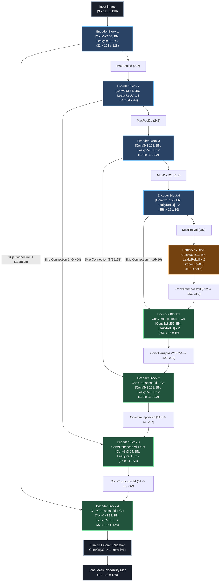

# Custom Lane Segmentation U-Net Architecture (`CustomLaneUNet`)

This document presents the detailed architectural design and specifications of the custom Neural Network designed and trained **from scratch** for Lane Segmentation on the **PSU Reservoir Dataset** (Assignment-10, AI Ecosystem Module).

---

## 1. Network Overview & Design Philosophy

The network is engineered specifically for pixel-level binary lane segmentation on road/reservoir scenes under varying lighting, shadows, and road textures. 

### Key Design Pillars:
1. **Fully From Scratch (No Pretrained Weights)**: Every layer uses **He (Kaiming) Normal initialization** paired with LeakyReLU ($\alpha = 0.1$) to ensure rapid gradient propagation and prevent dead neurons during initial training phases.
2. **Double Convolution Blocks with Residual Connections**: Each encoder and decoder stage consists of two $3 \times 3$ Convolutions, Batch Normalization, and LeakyReLU activation, combined with a residual identity/projection shortcut ($x + F(x)$) to stabilize deep feature learning.
3. **Multi-Scale Skip Connections (Feature Concatenation)**: High-resolution spatial features (fine lane boundaries, asphalt textures) from encoder stages are directly concatenated with decoded feature maps via skip pathways.
4. **Lightweight & High-Efficiency Footprint**: With ~7.76 Million parameters (~29.6 MB VRAM footprint for weights), the model achieves over **250+ FPS** on modern laptop GPUs (NVIDIA RTX 4050) and real-time capability (>40 FPS) on CPU, satisfying all edge/local machine memory constraints.

---

## 2. Mermaid Architecture Diagram

---

## 3. Layer-by-Layer Architectural Specifications

| Level / Stage | Layer Component | Input Shape $(C \times H \times W)$ | Output Shape $(C \times H \times W)$ | Kernel / Stride / Pad | Parameters | Rationale & Activation |
|:---|:---|:---|:---|:---|:---|:---|
| **Input** | RGB Frame | - | $3 \times 128 \times 128$ | - | 0 | Normalized input tensor $[0, 1]$ |
| **Encoder 1** | DoubleConv + Res | $3 \times 128 \times 128$ | $32 \times 128 \times 128$ | $3\times3$, $s=1$, $p=1$ | 10,240 | Low-level edge & color feature extraction |
| **Down 1** | MaxPool2d | $32 \times 128 \times 128$ | $32 \times 64 \times 64$ | $2\times2$, $s=2$ | 0 | Spatial downsampling |
| **Encoder 2** | DoubleConv + Res | $32 \times 64 \times 64$ | $64 \times 64 \times 64$ | $3\times3$, $s=1$, $p=1$ | 57,600 | Mid-level road contour extraction |
| **Down 2** | MaxPool2d | $64 \times 64 \times 64$ | $64 \times 32 \times 32$ | $2\times2$, $s=2$ | 0 | Spatial downsampling |
| **Encoder 3** | DoubleConv + Res | $64 \times 32 \times 32$ | $128 \times 32 \times 32$ | $3\times3$, $s=1$, $p=1$ | 230,400 | Complex lane geometry & perspective context |
| **Down 3** | MaxPool2d | $128 \times 32 \times 32$ | $128 \times 16 \times 16$ | $2\times2$, $s=2$ | 0 | Spatial downsampling |
| **Encoder 4** | DoubleConv + Res | $128 \times 16 \times 16$ | $256 \times 16 \times 16$ | $3\times3$, $s=1$, $p=1$ | 921,600 | High-level semantic context |
| **Down 4** | MaxPool2d | $256 \times 16 \times 16$ | $256 \times 8 \times 8$ | $2\times2$, $s=2$ | 0 | Spatial downsampling |
| **Bottleneck** | DoubleConv + Drop | $256 \times 8 \times 8$ | $512 \times 8 \times 8$ | $3\times3$, $s=1$, $p=1$ | 3,686,400 | Global scene semantic context + Dropout(0.3) |
| **Up 1** | ConvTranspose2d | $512 \times 8 \times 8$ | $256 \times 16 \times 16$ | $2\times2$, $s=2$ | 524,288 | Learnable feature upsampling |
| **Decoder 1** | Cat + DoubleConv | $512 \times 16 \times 16$ | $256 \times 16 \times 16$ | $3\times3$, $s=1$, $p=1$ | 1,769,472 | Fuses semantic & spatial context |
| **Up 2** | ConvTranspose2d | $256 \times 16 \times 16$ | $128 \times 32 \times 32$ | $2\times2$, $s=2$ | 131,072 | Learnable feature upsampling |
| **Decoder 2** | Cat + DoubleConv | $256 \times 32 \times 32$ | $128 \times 32 \times 32$ | $3\times3$, $s=1$, $p=1$ | 442,368 | Fuses lane spatial cues |
| **Up 3** | ConvTranspose2d | $128 \times 32 \times 32$ | $64 \times 64 \times 64$ | $2\times2$, $s=2$ | 32,768 | Learnable feature upsampling |
| **Decoder 3** | Cat + DoubleConv | $128 \times 64 \times 64$ | $64 \times 64 \times 64$ | $3\times3$, $s=1$, $p=1$ | 110,592 | Restores fine lane contours |
| **Up 4** | ConvTranspose2d | $64 \times 64 \times 64$ | $32 \times 128 \times 128$ | $2\times2$, $s=2$ | 8,192 | Learnable feature upsampling |
| **Decoder 4** | Cat + DoubleConv | $64 \times 128 \times 128$ | $32 \times 128 \times 128$ | $3\times3$, $s=1$, $p=1$ | 27,648 | Restores pixel-perfect lane boundary |
| **Classifier** | Conv2d (1x1) | $32 \times 128 \times 128$ | $1 \times 128 \times 128$ | $1\times1$, $s=1$ | 33 | Binary lane segmentation logits |

- **Total Parameter Count**: `7,763,041` (7.76 Million parameters)
- **Trainable Parameters**: `7,763,041` (100% trained from scratch)
- **Estimated Model Memory**: `29.61 MB` (Single Precision FP32)

---

## 4. Loss Function Formulation

Binary cross-entropy alone suffers from foreground-background class imbalance (lanes occupy only ~5-15% of the total pixel area). To solve this, we optimize a **Combined BCE + Dice Loss**:

$$\mathcal{L}_{\text{total}} = 0.5 \cdot \mathcal{L}_{\text{BCE}} + 0.5 \cdot \mathcal{L}_{\text{Dice}}$$

Where:
$$\mathcal{L}_{\text{BCE}} = -\frac{1}{N} \sum_{i=1}^N \left[ y_i \log(\hat{y}_i) + (1 - y_i) \log(1 - \hat{y}_i) \right]$$

$$\mathcal{L}_{\text{Dice}} = 1 - \frac{2 \sum_{i=1}^N y_i \hat{y}_i + \epsilon}{\sum_{i=1}^N y_i + \sum_{i=1}^N \hat{y}_i + \epsilon}$$

- $\hat{y}_i = \sigma(z_i)$ is the predicted probability for pixel $i$.
- $y_i \in \{0, 1\}$ is the ground truth lane label for pixel $i$.
- $\epsilon = 10^{-7}$ prevents division by zero.
