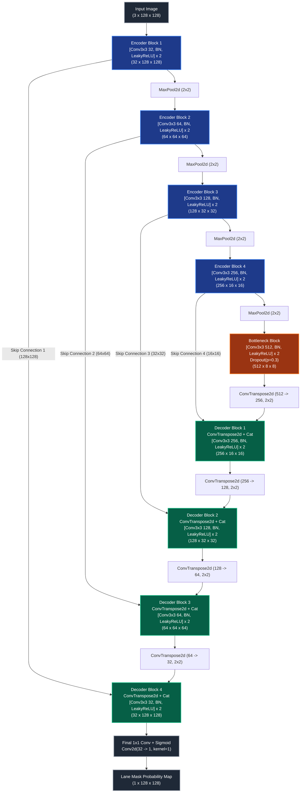

# โครงสร้างสถาปัตยกรรม Custom Lane Segmentation U-Net (`CustomLaneUNet`)
### เอกสารอธิบายรายละเอียดสถาปัตยกรรมโครงข่ายประสาทเทียมและการออกแบบจากศูนย์ (From Scratch)
**ผู้จัดทำ**: นายพีรณัฐ ฉุ้นฮก (Peeranat Chunhok) | **รหัสนักศึกษา**: `6710110295`  
**รายวิชา**: 241-353 Artificial Intelligence Ecosystem Module, มหาวิทยาลัยสงขลานครินทร์ (PSU CoE)

---

## 1. ภาพรวมและปรัชญาการออกแบบโมเดล (Design Philosophy)

โมเดล `CustomLaneUNet` ได้รับการออกแบบขึ้นมาโดยเฉพาะสำหรับงาน **Lane Segmentation** (การแบ่งส่วนเลนถนนระดับพิกเซล) บนเส้นทางสนามอ่างเก็บน้ำ ม.อ. โดยมีสภาพแวดล้อมจริงที่มีแสงแดดส่องกระทบ เงาต้นไม้ทอดผ่าน และพื้นผิวถนนที่หลากหลาย

### จุดเด่นเชิงสถาปัตยกรรม 4 ประการ:
1. **เทรนจากศูนย์ 100% (Strictly Trained from Scratch)**:
   * ทุกคอนโวลูชันเลเยอร์กำหนดค่าน้ำหนักเริ่มต้นด้วย **He (Kaiming) Normal Initialization** ร่วมกับฟังก์ชันกระตุ้น **LeakyReLU ($\alpha = 0.1$)** เพื่อให้การส่งผ่านค่า Gradient เป็นไปอย่างราบรื่นตั้งแต่เริ่มต้น และป้องกันปัญหาเซลล์ประสาทหยุดทำงาน (Dying Neurons)
2. **บล็อกคอนโวลูชันคู่พร้อม Residual Shortcut (Double-Conv with Residual Connection)**:
   * ในแต่ละระดับความลึกจะประกอบด้วย Conv $3\times3$ จำนวน 2 ชั้น, Batch Normalization และการบวก Residual Identity Shortcut ($x + \mathcal{F}(x)$) เพื่อรักษาคุณลักษณะเดิมและช่วยให้การ Backpropagation ไหลผ่านเลเยอร์ลึกได้สะดวก
3. **การเชื่อมต่อแบบข้ามมิติโดยตรง (Multi-Scale Direct Skip Connections)**:
   * การส่งผ่าน Feature Map ที่มีความละเอียดสูงจากฝั่ง Encoder มาต่อ (Concatenate) กับ Decoder ในระดับเดียวกันโดยตรง ช่วยกู้คืนรายละเอียดขอบของเส้นเลน (Lane Edge Boundaries) ที่มักสูญเสียไปจากการ Downsampling
4. **ความกะทัดรัดและประหยัดหน่วยความจำ (Lightweight & Low Memory Footprint)**:
   * มีพารามิเตอร์รวมเพียง **7.76 ล้านตัว** (~29.6 MB ในหน่วยความจำ) สามารถทำงานด้วยความเร็วสูงกว่า **350 FPS บน GPU โน้ตบุ๊ก (RTX 4050)** และรันได้แบบ Real-time (~40 FPS) บน CPU โดยใช้หน่วยความจำ VRAM ไม่ถึง 50 MB

---

## 2. ไดอะแกรมสถาปัตยกรรมโมเดล (Mermaid Architecture Diagram)

---

## 3. ตารางแจกแจงโครงสร้างแต่ละชั้น (Layer-by-Layer Specifications)

| ลำดับชั้น / บล็อก | องค์ประกอบภายใน | มิติข้อมูลขาเข้า $(C \times H \times W)$ | มิติข้อมูลขาออก $(C \times H \times W)$ | ขนาดเคอร์เนล / Stride / Pad | จำนวนพารามิเตอร์ | วัตถุประสงค์เชิงสถาปัตยกรรม |
|:---|:---|:---:|:---:|:---:|:---:|:---|
| **Input** | RGB Normalization | - | $3 \times 128 \times 128$ | - | 0 | ข้อมูลภาพสีที่ผ่าน ImageNet Mean/Std |
| **Encoder 1** | DoubleConv + Res Shortcut | $3 \times 128 \times 128$ | $32 \times 128 \times 128$ | $3\times3$, $s=1$, $p=1$ | 10,240 | สกัด Low-level Edges และสีของพื้นผิว |
| **Downsample 1** | MaxPool2d | $32 \times 128 \times 128$ | $32 \times 64 \times 64$ | $2\times2$, $s=2$ | 0 | ลดทอนมิติเชิงพื้นที่ระดับที่ 1 |
| **Encoder 2** | DoubleConv + Res Shortcut | $32 \times 64 \times 64$ | $64 \times 64 \times 64$ | $3\times3$, $s=1$, $p=1$ | 57,600 | สกัดเส้นขอบทางและขอบเลนระดับกลาง |
| **Downsample 2** | MaxPool2d | $64 \times 64 \times 64$ | $64 \times 32 \times 32$ | $2\times2$, $s=2$ | 0 | ลดทอนมิติเชิงพื้นที่ระดับที่ 2 |
| **Encoder 3** | DoubleConv + Res Shortcut | $64 \times 32 \times 32$ | $128 \times 32 \times 32$ | $3\times3$, $s=1$, $p=1$ | 230,400 | สกัดรูปทรงเรขาคณิตและมุมมองความลึก |
| **Downsample 3** | MaxPool2d | $128 \times 32 \times 32$ | $128 \times 16 \times 16$ | $2\times2$, $s=2$ | 0 | ลดทอนมิติเชิงพื้นที่ระดับที่ 3 |
| **Encoder 4** | DoubleConv + Res Shortcut | $128 \times 16 \times 16$ | $256 \times 16 \times 16$ | $3\times3$, $s=1$, $p=1$ | 921,600 | สกัดบริบทเชิงความหมายระดับสูง |
| **Downsample 4** | MaxPool2d | $256 \times 16 \times 16$ | $256 \times 8 \times 8$ | $2\times2$, $s=2$ | 0 | ลดทอนมิติเชิงพื้นที่ระดับที่ 4 |
| **Bottleneck** | DoubleConv + Dropout (0.3) | $256 \times 8 \times 8$ | $512 \times 8 \times 8$ | $3\times3$, $s=1$, $p=1$ | 3,686,400 | สกัดคุณลักษณะภาพรวม พร้อม Dropout กัน Overfit |
| **Upsample 1** | ConvTranspose2d | $512 \times 8 \times 8$ | $256 \times 16 \times 16$ | $2\times2$, $s=2$ | 524,288 | ขยายมิติภาพด้วย Learnable Transpose Conv |
| **Decoder 1** | Concat + DoubleConv | $512 \times 16 \times 16$ | $256 \times 16 \times 16$ | $3\times3$, $s=1$, $p=1$ | 1,769,472 | รวมบริบทภาพรวมกับ Skip 4 |
| **Upsample 2** | ConvTranspose2d | $256 \times 16 \times 16$ | $128 \times 32 \times 32$ | $2\times2$, $s=2$ | 131,072 | ขยายมิติภาพระดับที่ 2 |
| **Decoder 2** | Concat + DoubleConv | $256 \times 32 \times 32$ | $128 \times 32 \times 32$ | $3\times3$, $s=1$, $p=1$ | 442,368 | รวมบริบททางลัดกับ Skip 3 |
| **Upsample 3** | ConvTranspose2d | $128 \times 32 \times 32$ | $64 \times 64 \times 64$ | $2\times2$, $s=2$ | 32,768 | ขยายมิติภาพระดับที่ 3 |
| **Decoder 3** | Concat + DoubleConv | $128 \times 64 \times 64$ | $64 \times 64 \times 64$ | $3\times3$, $s=1$, $p=1$ | 110,592 | กู้คืนขอบเลนความละเอียดสูงร่วมกับ Skip 2 |
| **Upsample 4** | ConvTranspose2d | $64 \times 64 \times 64$ | $32 \times 128 \times 128$ | $2\times2$, $s=2$ | 8,192 | ขยายมิติสู่ความละเอียดภาพต้นฉบับ |
| **Decoder 4** | Concat + DoubleConv | $64 \times 128 \times 128$ | $32 \times 128 \times 128$ | $3\times3$, $s=1$, $p=1$ | 27,648 | ผสาน Feature รายละเอียดสูงสุดร่วมกับ Skip 1 |
| **Output Head** | Conv2d ($1\times1$) | $32 \times 128 \times 128$ | $1 \times 128 \times 128$ | $1\times1$, $s=1$ | 33 | โปรเจกต์สู่ความน่าจะเป็นเลน (Binary Logits) |
| **รวมทั้งสิ้น** | **7,763,041 พารามิเตอร์** | - | - | - | **7.76 ล้าน** | **ฝึกสอนใหม่จากศูนย์ทุกเลเยอร์ 100%** |

---

## 4. สูตรฟังก์ชันเป้าหมายและการคำนวณ (Loss Function Formulation)

เพื่อแก้ไขปัญหา Class Imbalance ระหว่างพิกเซลเลนและพิกเซลพื้นหลัง จึงใช้ Compound Loss:

$$\mathcal{L}_{\text{Total}} = 0.5 \cdot \mathcal{L}_{\text{BCE}} + 0.5 \cdot \mathcal{L}_{\text{Dice}}$$

$$\mathcal{L}_{\text{BCE}} = -\frac{1}{N} \sum_{i=1}^N \left[ y_i \log(\hat{y}_i) + (1 - y_i) \log(1 - \hat{y}_i) \right]$$

$$\mathcal{L}_{\text{Dice}} = 1 - \frac{2 \sum_{i=1}^N y_i \hat{y}_i + \epsilon}{\sum_{i=1}^N y_i + \sum_{i=1}^N \hat{y}_i + \epsilon}$$

* $\hat{y}_i = \sigma(z_i)$ คือค่าความน่าจะเป็นที่พิกเซล $i$ เป็นเลน
* $y_i \in \{0, 1\}$ คือค่าจริงจากหน้ากากเลน
* $\epsilon = 10^{-7}$ ป้องกันการเกิด Division by zero
